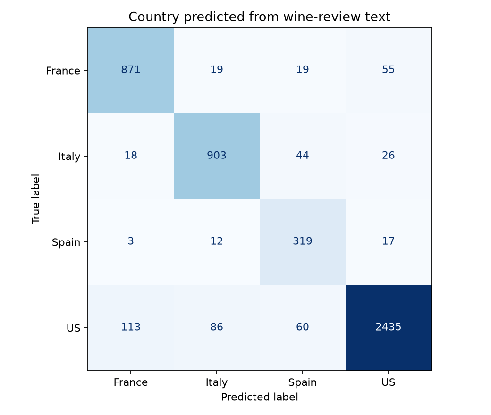
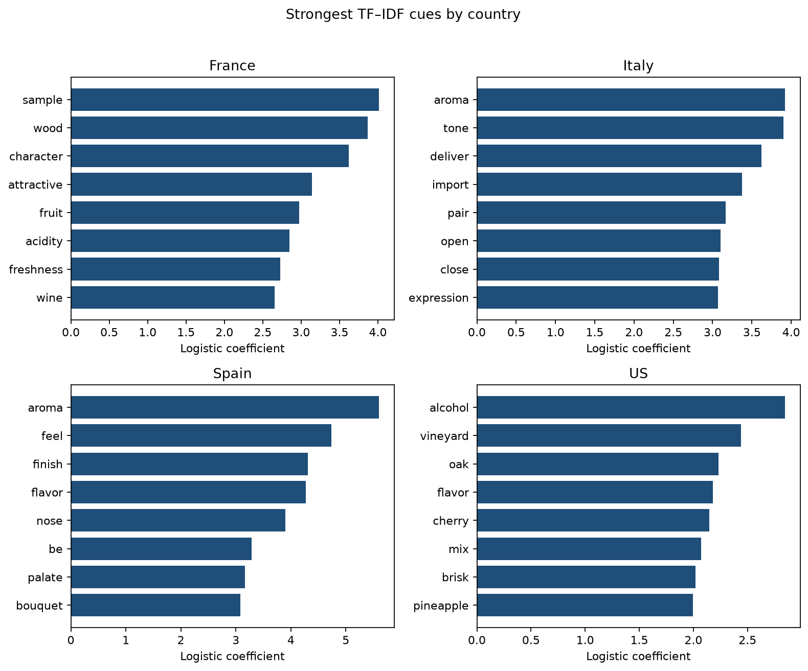

# Showcase

One end-to-end piece that demonstrates the DS³ text → model → evaluate → interpret loop.

## Country from wine reviews

**Notebook:** [`country_from_reviews.ipynb`](country_from_reviews.ipynb)

| Step | Method |
|---|---|
| Text → features | TF–IDF unigrams + bigrams |
| Model | Balanced multinomial logistic regression |
| Evaluation | Stratified held-out split, macro-F1, confusion matrix |
| Interpretation | Top coefficients per country |

**Result (reproducible with `random_state=42`):** macro-F1 ≈ **0.88**





### Run locally

```bash
pip install -r ../requirements.txt
jupyter notebook country_from_reviews.ipynb
```

To regenerate figures and embedded outputs:

```bash
python build_showcase.py
```

### When I’d use this

Open-ended survey answers, document triage, or any setting where labels exist but the signal lives in free text — start with a linear TF–IDF baseline before jumping to heavier NLP.
